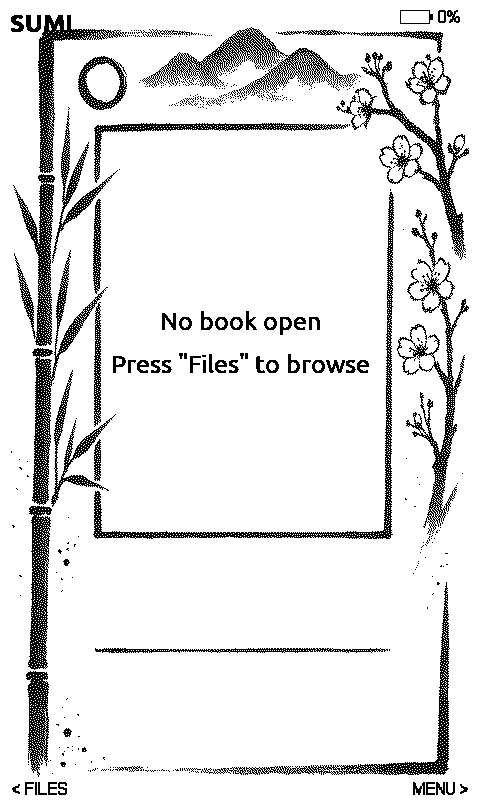
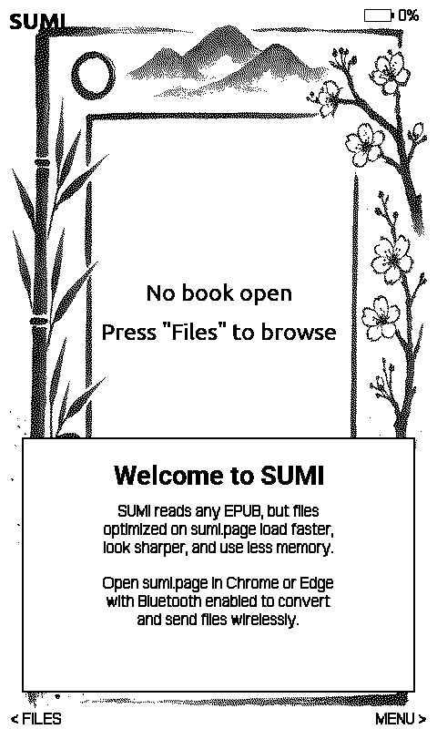
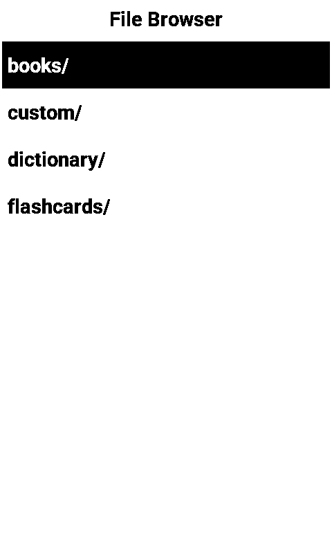
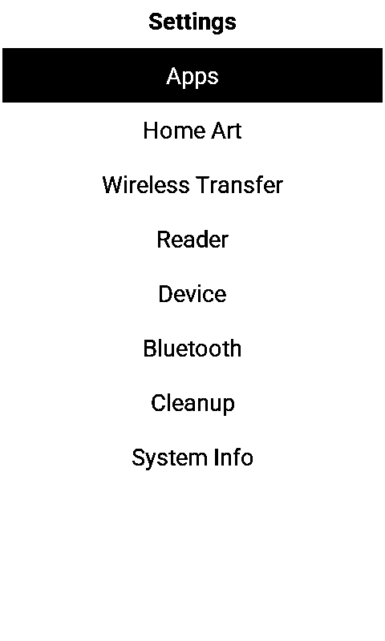
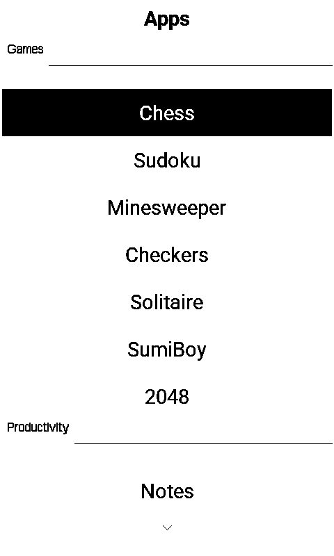

# SUMI

Custom e-ink firmware for the **Xteink X4 and X3** — ESP32-C3 e-readers with 380KB of RAM, five buttons, and 480×800 (X4) or 528×792 (X3) displays.

SUMI turns it into an offline-first reader with apps, a dictionary, Bluetooth keyboards, and a Game Boy emulator. No WiFi, no cloud, no accounts. Books and tools on paper-like glass.

> 📥 **Install or update:** flash directly from your browser at **[sumi.page/flasher](https://sumi.page/flasher/)** — works in Chrome and Edge, takes ~30 seconds, no drivers needed.

<p align="center">
  
</p>

> **Got existing ebooks?** Run them through the [Universal Converter](https://sumi.page/convert/) before loading. Most EPUBs are built for color tablets — oversized images, web fonts, heavy CSS. The converter strips all that out and tunes everything for e-ink: grayscale images at display resolution, clean XHTML, no junk. Same books, noticeably faster rendering on the 380KB device.

Built on [Papyrix](https://github.com/pliashkou/papyrix) by **Pavel Liashkov** ([@bigbag](https://github.com/bigbag)) — an excellent open-source reader firmware. Papyrix itself is a fork of [CrossPoint Reader](https://github.com/crosspoint-reader/crosspoint-reader) by Dave Allie. SUMI strips out WiFi, adds a plugin system, 20 apps, a StarDict dictionary, reading statistics, achievements, Bluetooth, and a visual rebrand. The reading engine is Pavel's and Dave's work — outstanding open-source software.

Companion tools at **[sumi.page](https://sumi.page)** — 13 browser-based tools for conversion, dictionaries, newspapers, flashcards, fonts, and file transfer.

---

## The essentials

### Home screen

Tracks your last 10 books. Up/Down scrolls through recently opened books, OK opens the selected one. No digging through folders to find what you were reading yesterday.

<p align="center">
  
</p>

### Files

Press Left from the home screen to open the file browser. Drop EPUBs, TXT, Markdown, or comic files anywhere on the SD card — the browser walks everything from root.

<p align="center">
  
</p>

**To delete or index a file:** press Right on any file. A popup opens with three options — "Index for faster reading", "Delete", and "Cancel". Pick Delete to get the confirmation dialog (Yes/No, default No for safety), or pick Index to pre-build the book's page cache on-device for instant loads.

### Settings

Press Right from the home screen. Everything's here: apps, home art themes, wireless transfer, reader settings, device controls, Bluetooth, cleanup, system info.

<p align="center">
  
</p>

### Apps — organized into categories

20 built-in apps grouped into **Games**, **Productivity**, and **Learning**. Hide apps you don't use in Settings → Apps.

<p align="center">
  
</p>

**Games:** Chess, Sudoku, Minesweeper, Checkers, Solitaire, SumiBoy (Game Boy emulator), 2048.

**Productivity:** Notes, Todo List, Tools, Pomodoro timer, Images viewer, Maps (OSM tile viewer), If Found (lost-device screen), Daily Quote, Sleep Screens picker, Reading Stats, Achievements.

**Learning:** Dictionary, Flashcards.

### Home Art themes

Choose from ten built-in 800×480 ink illustrations (sumi-e, art nouveau, celtic, botanical, woodcut, geometric, retro 70s, doodle, art deco, nautical) or drop your own 1-bit BMP into `/config/themes/`.

<p align="center">
  
</p>

---

## What else SUMI does

**Reads books.** EPUB, TXT, Markdown, XTC, comics. Adjustable fonts, sizes, margins, line spacing, alignment. Chapter navigation, progress tracking, cover art, thumbnails, CSS styling, inline images, RTL for Arabic, table rendering. Minimum-raggedness line breaking with Liang/Knuth hyphenation across 28 languages. Synthetic TOC fallback for EPUBs without a table of contents. Per-book settings overrides — change font size for one book without affecting your defaults.

**Indexes books for instant loads.** Heavy EPUB chapters can stress the parser when Bluetooth is also resident in RAM. From the file browser, press **Right** on a book → "Index for faster reading" pre-builds every chapter's page cache on the device (or upload to [sumi.page/process](https://sumi.page/process/) to do it on a desktop). Indexed books load instantly with Bluetooth on; chapter transitions don't stall. Tradeoff: font size, line spacing, and hyphenation get baked in at index time — change any of them later and the affected chapter caches rebuild lazily on next read. Same mechanism comics already use.

**Looks up words.** Drop one or more StarDict dictionaries into `/dictionary/<name>/`. SUMI auto-discovers all of them and searches every installed dictionary on each lookup, returning labelled definitions from each that has a hit. So you can keep GCIDE for general English, Etymology Online for word history, and a medical dictionary for technical terms — all three are consulted per lookup, no "which one is active" cognitive load. Inside the reader, **press Power** → "Look up Word" to highlight words on the current page and get definitions. Fuzzy matching and word-stemming fallback catch typos and plurals. Per-book lookup history so you can review words you encountered.

> Grab free dictionaries from [FireDict's download page](https://tuxor1337.frama.io/firedict/dictionaries.html) — GCIDE (108k words), Etymology Dictionary (46k words), and others. Or package your own with the [Dictionary Packager](https://sumi.page/dictionary/).

**Bookmarks.** Mark any page with a bookmark. View all bookmarks in one book, or "All Bookmarks" across every book on the device.

**Tracks reading.** Per-book session time, page counts, streaks. Reading Stats app shows a monthly heatmap with reading activity. Unlock achievements as you read (40 of them, from "First Page" to "200 Hours").

**Runs apps.** 20 built-in plugins plus user Lua scripts — a sandboxed plugin system where Lua `.lua` files in `/custom/` become launchable apps. The Lua API has 46 functions for drawing, file I/O, time, battery, and settings.

**Syncs time over BLE.** No WiFi, no NTP — when you connect from sumi.page via Bluetooth, SUMI picks up the current time automatically. The clock survives deep sleep via the RTC timer and persists across power loss via NVS flash.

**Types.** Pair any BLE keyboard and type in the Notes editor. BLE page turners work in the reader. Real typing on an e-ink screen, real page turns without touching the device.

<p align="center">
  
</p>

**Plays Game Boy.** SumiBoy streams Game Boy ROMs from the SD card and emulates them onboard. Drop `.gb` files in `/games/` and launch from the plugin menu. Pokemon on an e-ink screen runs at about 3 FPS and it's still somehow fun.

<p align="center">
  
</p>

---

## Uploading files

Two ways to get content onto SUMI:

**Over Bluetooth (no cable).** Open [sumi.page](https://sumi.page) in Chrome or Edge, click "Connect to SUMI" in any tool (converter, newspaper, flashcards, fonts, themes, file transfer), and stream files straight to the SD card. The site converts and uploads in one step — pick an EPUB, it gets optimized and sent in seconds.

**Over USB (the classic way).** Remove the SD card and copy files with your file manager. Plug it back in and the device picks up changes on next boot.

Every time you connect over Bluetooth, SUMI's clock auto-syncs to your computer's time. No setup required.

---

## What comes from where

SUMI wouldn't exist without Papyrix and CrossPoint. Here's an honest accounting.

### Papyrix / CrossPoint: the reader foundation (~85,600 lines, ~75%)

The EPUB engine (streaming XML parser, ZIP decompression, OPF metadata, TOC parsing, CSS, HTML-to-pages renderer, inline images, text layout, justification, RTL). ReaderState (pagination, background caching, spine navigation, progress). The rendering stack (1-bit graphics, bitmap fonts, dithering, fax compression). Text shaping (Arabic, Thai, script detection). The state machine, content providers, all the core libraries. This is the hard code and Pavel Liashkov and Dave Allie wrote it.

### SUMI removed WiFi (~4,400 lines)

The ESP32-C3 has 380KB of RAM and WiFi eats ~100KB while fragmenting the heap. Removing it buys enough memory for plugins, BLE, and the dictionary. Gone: WiFi driver, web server, credential store, Calibre OPDS sync, network states.

### SUMI added (~28,000 lines)

The plugin framework and 20 plugins. Lua 5.4 runtime and 46-function API. BLE file transfer, HID input, and time sync. StarDict dictionary engine with fuzzy matching and stemming. Bookmarks (per-book + global index). Reading statistics with daily heatmap tracking. 40-achievement system. I18n framework with 6 languages. Per-book reader overrides. Sleep screen cache. Synthetic TOC fallback. Content hint pipeline. Library index. Memory arena and bump allocator. Minimum-raggedness line breaking. Liang/Knuth hyphenation (28 languages). Async display refresh. Flash thumbnail cache. Home screen art and themes. File browser delete + hidden files toggle. Crash resilience (skips auto-open if the previous session crashed). Text darkness control (4 levels of AA intensity).

---

## Hardware

| | **Xteink X4** (4.3″) | **Xteink X3** (3.7″) |
|---|---|---|
| **MCU** | ESP32-C3 (RISC-V, single core, 160 MHz) | Same |
| **RAM** | 380 KB usable (WiFi disabled) | Same |
| **Display** | 800×480 e-ink, 1-bit, SSD1677 | 792×528 e-ink, 1-bit (different controller) |
| **Storage** | SD card (FAT32) | Same |
| **Input** | 5-way d-pad + power button | Same buttons, slightly different layout |
| **Connectivity** | Bluetooth LE 5.0 | Same |
| **Extra peripherals** | — | BQ27220 fuel gauge, DS3231 RTC, QMI8658 IMU |

**One firmware, two devices.** SUMI auto-detects the hardware at first boot by I2C-probing for X3-only chips (BQ27220 fuel gauge, DS3231 RTC, QMI8658 IMU). The result is cached in NVS flash so subsequent boots are instant. If detection ever misfires, you can force X4 or X3 mode via the NVS override key `cphw:dev_ovr` (0=auto, 1=X4, 2=X3).

> **X3 support status (0.5.1):** hardware detection, runtime display dimensions, X3 panel init, and X3 refresh waveform are all ported from Crosspoint master and merged. B&W reading should work out of the box. Grayscale/AA rendering on X3 still uses the X4 path and may show artifacts until ported in a future release — if you see this, turn off "Text Anti-Aliasing" in Settings → Reader for a cleaner look.

## SD Card layout

Drop your EPUBs anywhere — the file browser walks everything from root. These folders are either auto-created or optional:

```
/
├── (your books, anywhere)
├── books/              ← Default book location
├── comics/             ← Comic/manga EPUBs
├── dictionary/         ← StarDict dictionaries, one folder per dict
│   └── english/        ←   english.ifo + english.idx + english.dict + english.cache
├── config/
│   ├── fonts/          ← Custom .bin fonts from sumi.page/fonts
│   └── themes/         ← Home art themes (800×480 1-bit BMP) + .theme files
├── custom/             ← Lua plugin scripts (.lua)
├── flashcards/         ← .tsv/.csv decks
├── games/              ← Game Boy ROMs (.gb, .gbc) for SumiBoy
├── images/             ← .bmp files for Images app (auto-created)
├── sleep/              ← .bmp files for random sleep screens (480×800)
├── maps/               ← Map tile BMPs or OSM /<zoom>/<x>/<y>.png tree
├── notes/              ← Notes plugin saves here (auto-created)
├── screenshots/        ← Screenshots saved here (Back+Up combo)
├── if_found.txt        ← Lost-device contact info (optional)
├── quotes.txt          ← Daily Quote source (pipe-delimited: "quote|author")
└── .sumi/              ← System, don't touch
    ├── settings.bin    ← User preferences (v16)
    ├── library.bin     ← Per-book progress + content hints
    ├── recent.bin      ← Recent books for home carousel
    ├── reading_stats.bin  ← Per-book reading time + daily heatmap
    ├── achievements.bin   ← Unlocked achievements
    ├── global_bookmarks.bin  ← Cross-book bookmark index
    └── cache/          ← Thumbnail and format caches
```

## Building

Requires [PlatformIO](https://platformio.org/).

```bash
pio run                    # Build
pio run -t upload          # Flash via USB
pio device monitor         # Serial console
```

Or flash from Chrome: **[sumi.page/flasher](https://sumi.page/flasher/)**

## Plugin development

### Lua plugins (easiest — no compilation)

Drop a `.lua` file in `/custom/` on the SD card. Restart the device and it appears in the Apps list.

```lua
function init(w, h)
  -- called once with screen dimensions (480, 800)
end

function draw()
  fillScreen(WHITE)
  drawHeader("My Plugin")
  text("Hello from Lua!")
end

function onButton(btn)
  if btn == "back" then return false end
  return true
end
```

The Lua VM runs with a 40KB memory cap and a 100K instruction limit per call. The API has 46 functions for drawing (lines, rects, circles, text), file I/O (sandboxed to `/custom/<name>_data/`), time (getTime, getTimeStr), battery, and settings.

Scaffold and validate plugins with AI assistance at **[sumi.page/plugins](https://sumi.page/plugins/)**.

### Plugin Bridge — live BLE messaging to your laptop

Plugins have a new global `bridge` table that exchanges JSON messages with any paired web browser (sumi.page/bridge or your own client):

```lua
bridge.publish("doorbell/ring", { at = sumi.getTime() })   -- send to site
bridge.on("text/import", function(data)                    -- receive from site
  sumi.writeFile("inbox.txt", data.content)
end)
bridge.keep_awake(60)                                       -- defer auto-sleep
```

The companion page at **[sumi.page/bridge](https://sumi.page/bridge/)** has two tabs: **Build** generates a complete AI prompt (the full Lua + Bridge API surface is inlined, so any AI writes correct code cold), **Run** connects to the device and hosts built-in handlers (Text Importer, Doorbell receiver) plus a sandboxed Custom Handler slot where you paste HTML the AI gave you. End result: users describe what they want, any AI writes both halves, files drop straight to the device — no feature requests needed.

See `docs/PLUGIN_BRIDGE.md` (protocol) and `docs/PLUGIN_AUTHORING_PROMPT.md` (copy-paste-into-any-AI system prompt).

### C++ plugins

```cpp
class MyPlugin : public PluginInterface {
public:
    const char* name() const override { return "My Plugin"; }
    void init(int w, int h) override { /* setup */ }
    bool handleInput(PluginButton btn) override { return btn != PluginButton::Back; }
    void draw() override {
        renderer_.fillScreen(GxEPD_WHITE);
        renderer_.setCursor(10, 30);
        renderer_.print("Hello!");
    }
};
```

Register in `main.cpp` and rebuild the firmware.

## Memory

ESP32-C3 has ~400KB SRAM. With WiFi disabled and BLE-only, SUMI has ~300KB available for application use.

**Memory Arena (76 KB, linker-placed in `.bss`)** — Single contiguous block reserved at link time, never allocated from heap, never released, never re-acquired. The arena is sliced into a 32 KB primary buffer (time-shared between image decode, ZIP decompression, and SumiBoy's GB ROM), a 20 KB work buffer (row I/O, dithering, scaling, 8 KB scratch), and a 24 KB FreeRTOS stack region used by the background `cacheTask`. Eliminates heap allocation for both image processing and the bg cache task — the two heaviest memory consumers in the reader path. v0.6.0 reworked this from three independent runtime allocations to one `.bss`-placed block so heap fragmentation under BLE pressure no longer threatens it.

**Bump allocator** — The 8KB scratch region doubles as a bump allocator via `scratchAlloc()`. Text layout uses this for DP line-breaking arrays and hyphenation vectors, avoiding heap fragmentation.

**Everything streams** — EPUB parsed via streaming XML, never loaded fully. Page layouts cached to SD. Thumbnails stored in LittleFS flash for instant home screen. Library index at 9 bytes per book.

**Async display refresh** — The e-ink waveform (80–3000ms depending on mode) runs on a background FreeRTOS task so the main loop stays responsive during screen updates.

**Reader concurrency** — `ReaderState::render()` brackets every paint with `stopBackgroundCaching()` / `startBackgroundCaching()` so the main task and `cacheTask` never touch the renderer's shared `wordWidthCache` concurrently. The bg task still pre-extends the page cache during the e-ink refresh wait; it just doesn't compete with main during the layout/draw work. See [docs/CONCURRENCY.md](docs/CONCURRENCY.md).

## Testing

Host unit tests run on MinGW with 44+ binaries covering the EPUB parser, dictionary lookup, page cache, font rendering, Arabic/Thai shaping, line breaking, and more. Build with `make test-build` and run with `make test-run`.

## Credits

SUMI is built on **Papyrix** by **Pavel Liashkov** ([@bigbag](https://github.com/bigbag)), which is itself a fork of **CrossPoint Reader** by **Dave Allie**. The reader engine, EPUB parser, rendering pipeline, font system, text shaping, and state machine are their work. Outstanding open-source software.

- [Papyrix](https://github.com/pliashkou/papyrix) by Pavel Liashkov (MIT License)
- [CrossPoint Reader](https://github.com/crosspoint-reader/crosspoint-reader) by Dave Allie (MIT License)
- **@ngxson** — Power management and button remapping
- **sumi.page** — Companion web tools

## License

MIT. See LICENSE file.
